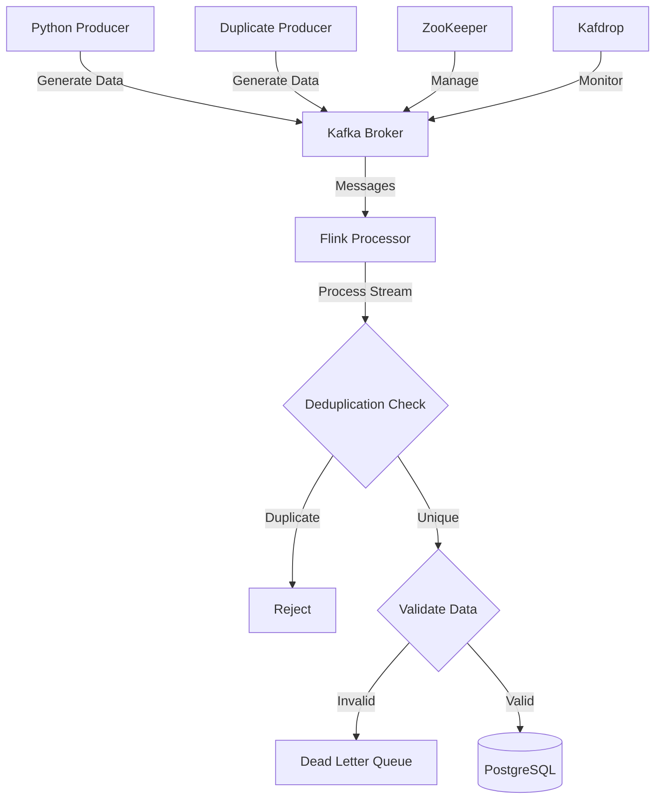

# Pipeline de Processamento de Dados de Saúde em Tempo Real

Este projeto é uma POC focada no processamento de dados de saúde em tempo real, utilizando tecnologias de streaming de dados.

## Objetivo

Desenvolver e avaliar um pipeline de processamento de dados de saúde em tempo real que garanta:
- Processamento confiável com semântica exactly-once
- Deduplicação eficiente de dados
- Validação em tempo real dos sinais vitais
- Persistência consistente dos dados

## Arquitetura



## Stack Tecnológica

- **Apache Kafka**: Message broker para ingestão de dados em tempo real
- **Apache Flink**: Framework de processamento distribuído para análise em tempo real
- **PostgreSQL**: Banco de dados para armazenamento persistente
- **Python**: Geração de dados simulados de saúde
- **Java**: Implementação do pipeline de processamento

## Funcionalidades Principais

1. **Ingestão de Dados**
   - Simulação de dados de múltiplos dispositivos médicos
   - Suporte a alta frequência de eventos
   - Garantia de entrega de mensagens

2. **Processamento em Tempo Real**
   - Deduplicação baseada em ID do paciente e timestamp
   - Validação de dados vitais
   - Checkpointing para recuperação de falhas
   - Processamento com garantia exactly-once

3. **Persistência**
   - Armazenamento otimizado para consultas temporais
   - Garantia de consistência dos dados
   - Suporte a upserts para atualizações

## Estrutura dos Dados

```json
{
  "patientId": "uuid-string",
  "heartRate": 75.0,
  "temperature": 36.8,
  "oxygenSaturation": 98.0,
  "timestamp": 1645564800000
}
```

## Configuração e Execução

### Pré-requisitos
- Docker e Docker Compose
- Java 11+
- Python 3.8+
- Maven 3.6+

### Execução

1. Iniciar infraestrutura:
```bash
docker-compose up -d
```

2. Compilar pipeline Java:
```bash
cd health-data-pipeline
mvn clean package
cd ..
```

3. Executar pipeline:
```bash
java --add-opens=java.base/java.lang=ALL-UNNAMED --add-opens=java.base/java.util=ALL-UNNAMED --add-opens=java.base/java.nio=ALL-UNNAMED --add-opens=java.base/sun.nio.ch=ALL-UNNAMED -jar target/health-data-pipeline-1.0-SNAPSHOT.jar \
  --kafka.bootstrap.servers localhost:9092 \
  --postgres.host localhost \
  --postgres.port 5432 \
  --postgres.db health_db \
  --postgres.user health_user \
  --postgres.password health_password
```

4. Iniciar gerador de dados:
```bash
python python/duplicate_health_producer.py 
```

## Monitoramento

- Kafdrop (Monitoramento Kafka): http://localhost:9000
- Flink Dashboard (Métricas): http://localhost:8081

## Resultados e Análises

Os dados processados podem ser analisados através de consultas SQL no PostgreSQL. Exemplo de análise temporal:

```sql
SELECT 
    patient_id,
    AVG(heart_rate) as avg_heart_rate,
    AVG(temperature) as avg_temperature,
    AVG(oxygen_saturation) as avg_oxygen,
    COUNT(*) as total_readings
FROM health_records
WHERE timestamp >= extract(epoch from now() - interval '1 hour') * 1000
GROUP BY patient_id;
```

## Referências

- Apache Flink Documentation
- Apache Kafka Documentation
- Streaming Systems (Tyler Akidau et al.)
- Designing Data-Intensive Applications (Martin Kleppmann)
